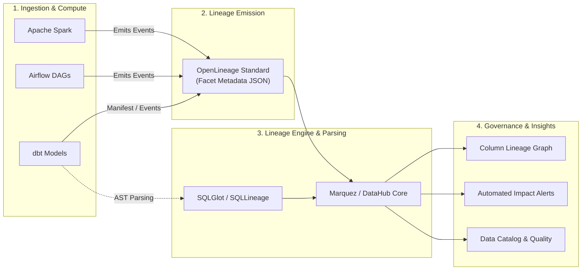

# ⚡ Awesome SQL Lineage & Data Provenance Ecosystem

**A Curated Directory of Enterprise SaaS Platforms, Open-Source Tools, SQL Parsers, and Column-Level Lineage Standards**

*Mastering Column-Level Lineage, SQL AST Parsing, Data Cataloging, Impact Analysis, Data Quality Observability & Metadata Governance*

  
  
  
  
  
  

---

## 📖 Overview & SEO Summary

**SQL Lineage** and **Data Provenance** platforms construct end-to-end directed acyclic graphs (DAGs) tracing data transformations from raw ingestion layers through data warehouses (Snowflake, BigQuery, Databricks, Redshift), transformation engines (dbt, Apache Spark, Trino), and business intelligence dashboards (Looker, Tableau, Power BI, Metabase).

### 🔍 Key Capabilities
- 🎯 **Column-Level Lineage (CLL)**: Pinpoint precise column transformations and mathematical operations across complex nested SQL queries and stored procedures.
- 💥 **Automated Impact Analysis**: Forecast upstream and downstream breaking schema changes before deploying code to production.
- 🛡️ **Regulatory & Data Governance Compliance**: Satisfy BCBS 239, GDPR, HIPAA, and CCPA auditing with automated data flow provenance.
- ⚡ **Root Cause Analysis (RCA)**: Accelerate incident debugging by correlating pipeline failures directly with source-to-dashboard lineage.

---

## 📑 Table of Contents

- [☁️ SaaS & Enterprise Hosted Platforms](#️-saas--enterprise-hosted-platforms)
- [🔓 Open-Source GitHub Projects](#-open-source-github-projects)
- [🧩 Architecture: Open Lineage Stack](#-architecture-open-lineage-stack)
- [🤝 How to Contribute](#-how-to-contribute)
- [📈 Star History](#-star-history)
- [📜 Disclaimer & License](#-disclaimer--license)

---

## ☁️ SaaS & Enterprise Hosted Platforms

> 📊 **Market Overview**: The global **Data Lineage and Active Metadata Management** market is valued at approximately **$6.2 Billion in 2026** (projected to reach **$15.8 Billion by 2031 at a 20.5% CAGR**). The sector is currently **moderately fragmented**, actively moving toward strategic consolidation as enterprise hyperscalers (Microsoft, IBM, Google Cloud) expand end-to-end governance suites, while high-growth modern data stack platforms (Atlan, Acryl Data, Secoda) compete aggressively on automated column parsing, collaboration, and AI agent integrations.

*Platforms below are sorted by **Company Valuation / Market Capitalization / Revenue Scale (Descending)**.*

| Platform | Company Valuation / Revenue Scale | Starting Pricing | Free Tier / Free Trial Limits | Description & Key Strengths |
| :--- | :--- | :--- | :--- | :--- |
| **[Microsoft Purview](https://azure.microsoft.com/en-us/products/purview)** | **~$3.1 Trillion** *(Microsoft Parent Cap)* | **$0.40/hour** per DGPU + **$1.00/mo** per 100 governed assets | **Free tier forever** for up to **1,000 annotated data assets** + 1 MB metadata storage free (requires active usage within 90 days) | 🏢 Unified governance and cataloging suite deeply integrated across Azure Synapse, Data Factory, Fabric, Power BI, and multi-cloud estates. |
| **[Manta](https://www.getmanta.com/)** *(IBM)* | **~$220 Billion** *(IBM Parent Cap; acquired for ~$150M+)* | **~$5,000/mo** ($60,000/yr base contract) or via IBM RUs at ~$0.41/RU-hr | **30-day free trial** via IBM Cloud Pak for Data sandbox (1 deployment env, 100 compute units, 1 data fabric project) | 🏛️ Deep automated code-level and SQL lineage platform specializing in legacy ETL (Informatica, SSIS, DataStage), stored procedures, and complex dialect parsing. |
| **[Collibra](https://www.collibra.com/)** | **~$5.25 Billion** *(Series G Valuation; $200M+ ARR)* | **~$14,167/mo** ($170,000/yr base subscription for Core Platform) | **20-day free trial** for Data Quality & Observability module (up to 5 data connections; interactive sandbox for core platform) | 🛡️ Enterprise data intelligence cloud platform uniting automated technical lineage with business glossaries, stewardship workflows, and compliance audits. |
| **[Atlan](https://atlan.com/)** | **~$750 Million** *(Series C Valuation; $30M+ ARR)* | **~$6,250/mo** ($75,000/yr base contract for Growth tier) | **Free tier for 1 user** (single-user read/catalog access) or **14-day guided trial** (up to 5 data sources, 10 users) | 🚀 Modern active metadata workspace and column lineage engine built natively for the modern data stack (Snowflake, dbt, Databricks, BigQuery). |
| **[Astronomer Astro](https://www.astronomer.io/)** | **~$500 Million** *(Series C Valuation; $35M+ ARR)* | **$0.35/hour** (~$250/mo base for Developer tier) + $0.13/hr per worker | **14-day free trial** with **$20 free compute credits** (no credit card required, unlimited DAG lineage runs within credit cap) | 🛰️ Managed Apache Airflow & OpenLineage platform providing unified pipeline observability, automated task dataset lineage, and runtime dependency graphs. |
| **[Acryl Cloud](https://datahubproject.io/)** *(DataHub Managed)* | **~$150 Million** *(Series A Valuation; $10M+ ARR)* | **~$1,667/mo** ($20,000/yr base subscription for Team/Business tier) | **14-day free trial / sandbox PoC** (up to 3 connectors, 10 user seats; open-source DataHub is free self-hosted under Apache 2.0) | 🌐 Managed commercial control plane for LinkedIn DataHub offering automated warehouse ingestion, column-level lineage graphs, and impact analysis. |
| **[CastorDoc](https://www.castordoc.com/)** *(Coalesce Catalog)* | **~$100 Million** *(Acquired by Coalesce; $23.5M Series A)* | **~$833/mo** ($10,000/yr Starter tier) | **14-day free trial** (up to 3 warehouse connectors, 5 team members, full automated metadata & lineage scanning) | 🔎 Collaborative data catalog and automated SQL lineage engine tailored for analytics engineering teams and BI discoverability (Looker, Tableau, Metabase). |
| **[OvalEdge](https://www.ovaledge.com/)** | **~$40 Million** *(Valuation; ~$8M-$10M Annual Revenue)* | **$1,300/mo** ($15,600/yr Essential plan) or **$100/user/mo** | **30-day free trial / First Month Free** package (up to 2 connected databases, 5 users, full lineage exploration) | 📊 End-to-end data catalog, governance suite, and code-level lineage tool with query log parsing, stored procedure tracing, and impact reports. |
| **[Secoda](https://www.secoda.co/)** | **~$35 Million** *(Series A Valuation; $3M+ ARR)* | **$99/mo** (Starter plan) or **~$2,000/mo** ($24,000/yr for Growth tier) | **14-day free trial** (no credit card required, up to 2 data warehouse integrations, 5 users) | 🤖 AI-assisted data workspace and automated column lineage engine featuring natural-language search and automated Slack/Teams change alerts. |
| **[Alex Solutions](https://www.alexsolutions.com.au/)** | **~$25 Million** *(Valuation; ~$5M-$7M Annual Revenue)* | **~$3,500/mo** ($42,000/yr base enterprise tier) | **14-day free trial** upon request (evaluation environment with 3 custom metadata sources, sample enterprise lineage models) | 📋 Enterprise-grade metadata management and data lineage platform designed for highly regulated banking, healthcare, and governmental environments. |
| **[Gudu SQLFlow Cloud](https://sqlflow.gudusoft.com/)** | **~$10 Million** *(Gudusoft Valuation; ~$2M ARR)* | **$49.99/mo** (Premium Cloud, or $599.88/yr); On-prem starts at $500/mo | **Free forever tier** (web UI SQL parser, up to 20 queries/day) + **3-day Premium trial** (10,000 SQL statements/mo, REST API access) | ⚡ Instant SQL dialect parsing and column-level visualizer supporting 20+ major relational, cloud warehouse, and NoSQL SQL dialects. |

---

## 🔓 Open-Source GitHub Projects

*Open-source repositories below are sorted by **GitHub Stars (Descending)**.*

| Repository | Stars Badge *(Links to Stargazers)* | Category | Description |
| :--- | :--- | :--- | :--- |
| **[open-metadata/OpenMetadata](https://github.com/open-metadata/OpenMetadata)** |  | 🌐 Data Catalog & Lineage | Open Context Layer and data catalog with end-to-end column-level lineage, automated SQL query parsing, and data quality profiling. |
| **[dbt-labs/dbt-core](https://github.com/dbt-labs/dbt-core)** |  | 🔄 SQL Transformation | Industry standard SQL transformation tool generating built-in DAG dependency graphs and model-level lineage documentation. |
| **[datahub-project/datahub](https://github.com/datahub-project/datahub)** |  | 📊 Metadata Platform | Leading extensible open-source metadata platform featuring interactive column-level lineage, warehouse log ingestion, and governance. |
| **[sqlfluff/sqlfluff](https://github.com/sqlfluff/sqlfluff)** |  | 🧹 SQL Linter & AST | Modular SQL linter and auto-formatter supporting multiple SQL dialects with rich parse tree and AST inspection capabilities. |
| **[tobymao/sqlglot](https://github.com/tobymao/sqlglot)** |  | ⚙️ SQL Parser & Transpiler | Ultra-fast Python SQL parser, transpiler, and column-level lineage generator supporting 20+ SQL dialects. |
| **[amundsen-io/amundsen](https://github.com/amundsen-io/amundsen)** |  | 🔍 Data Discovery | Data discovery and metadata engine (Lyft origin) with table/column metadata indexing and lineage integration connectors. |
| **[andialbrecht/sqlparse](https://github.com/andialbrecht/sqlparse)** |  | 🧩 SQL Tokenizer | Non-validating SQL parser module for Python providing low-level lexing, tokenization, and statement splitting. |
| **[OpenLineage/OpenLineage](https://github.com/OpenLineage/OpenLineage)** |  | 📜 Open Standard | Open standard for lineage metadata collection with official integrations for Spark, Airflow, dbt, Flink, and Trino. |
| **[elementary-data/elementary](https://github.com/elementary-data/elementary)** |  | 🔬 Data Observability | dbt-native data observability solution monitoring pipeline health, data anomalies, schema drift, and transformation lineage. |
| **[MarquezProject/marquez](https://github.com/MarquezProject/marquez)** |  | 📈 Lineage Backend & UI | Reference implementation for OpenLineage API collecting, aggregating, and visualizing dataset dependencies and run histories. |
| **[apache/atlas](https://github.com/apache/atlas)** |  | 🏛️ Enterprise Governance | Scalable open metadata and governance framework with deep lineage support across Hadoop, Hive, Spark, and Kafka. |
| **[reata/sqllineage](https://github.com/reata/sqllineage)** |  | 🐍 Python Lineage Tool | Lightweight Python SQL lineage analysis tool providing command-line inspection and interactive DAG visualization. |
| **[astronomer/astronomer-cosmos](https://github.com/astronomer/astronomer-cosmos)** |  | 🚀 Pipeline Orchestration | Runs dbt projects as native Apache Airflow DAGs with automatic task generation and OpenLineage emitting. |
| **[datacontract/datacontract-cli](https://github.com/datacontract/datacontract-cli)** |  | 📋 Data Contracts | CLI and Python library to define, enforce, and test Data Contracts with schema validation and lineage metadata. |
| **[odpi/egeria](https://github.com/odpi/egeria)** |  | 🔗 Metadata Exchange | Open-source metadata exchange standard facilitating federated governance and lineage interoperability across vendors. |
| **[macbre/sql-metadata](https://github.com/macbre/sql-metadata)** |  | 🏷️ SQL Metadata Extractor | Fast Python helper to extract tables, columns, and query aliases from raw SQL statements using tokenization. |

---

## 🧩 Architecture: Open Lineage Stack

---

## 🤝 How to Contribute

We welcome community contributions to keep this ecosystem comprehensive, accurate, and up-to-date!

1. 🍴 **Fork the repository** on GitHub.
2. 🌿 **Create a new branch**: `git checkout -b add-lineage-tool`
3. 📝 **Add or update an entry**:
   - For **SaaS tools**, ensure specific starting price, verified free tier/trial limits, valuation/revenue, and key strengths.
   - For **Open-Source tools**, add the social white badge linking to stargazers and place in the correct star-count order.
4. 🚀 **Submit a Pull Request** with a concise description of your changes.

Check out our master collection at [Awesome-Awesome-Awesome](https://github.com/ishandutta2007/Awesome-Awesome-Awesome)!

---

## 📈 Star History

---

## 📜 Disclaimer & License

- 🛡️ This list is curated for educational, architectural, and evaluation purposes.
- ⚖️ Distributed under the [MIT License](LICENSE).
